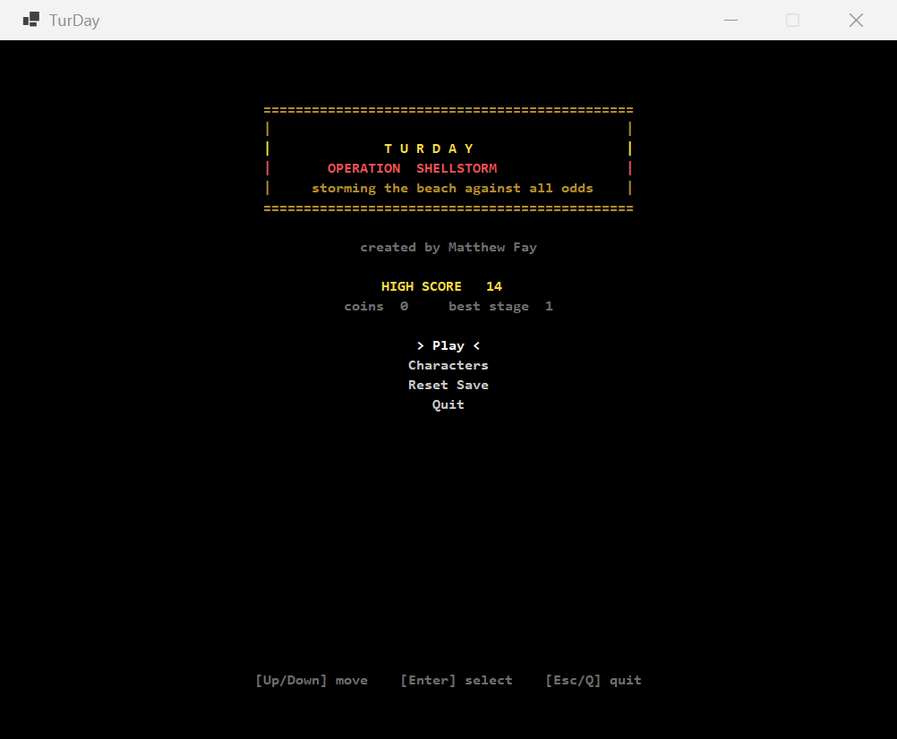
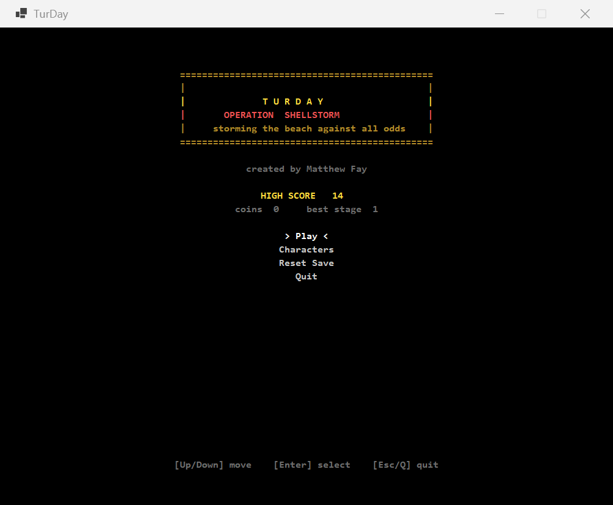
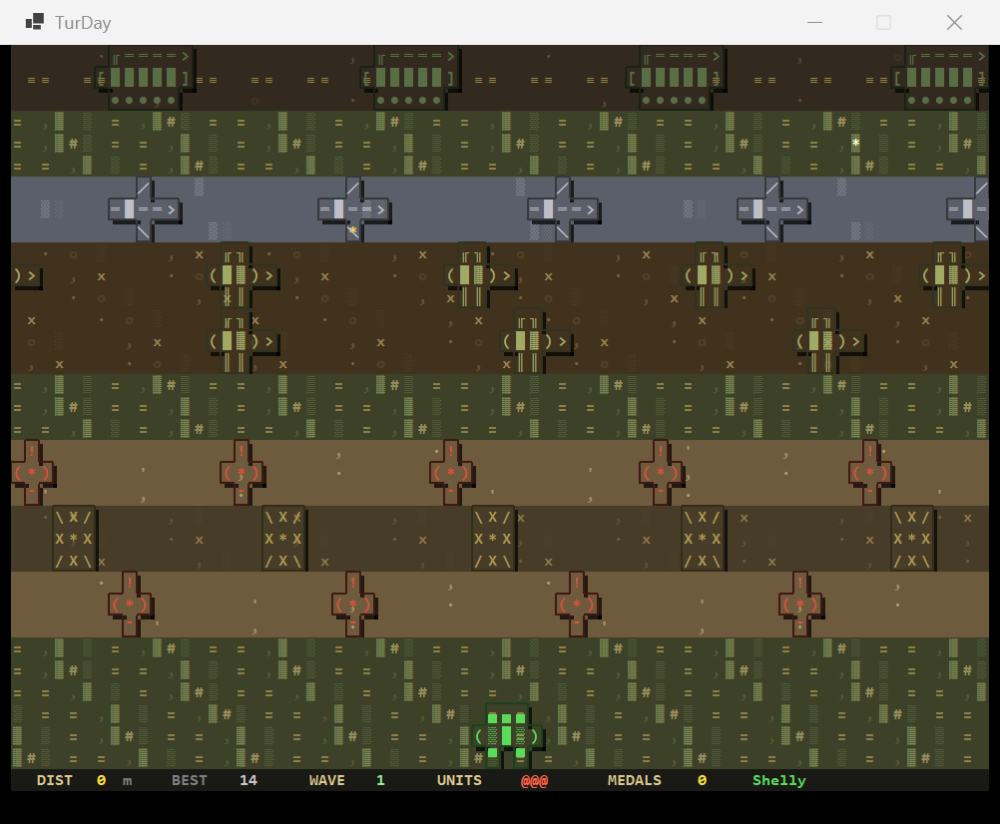
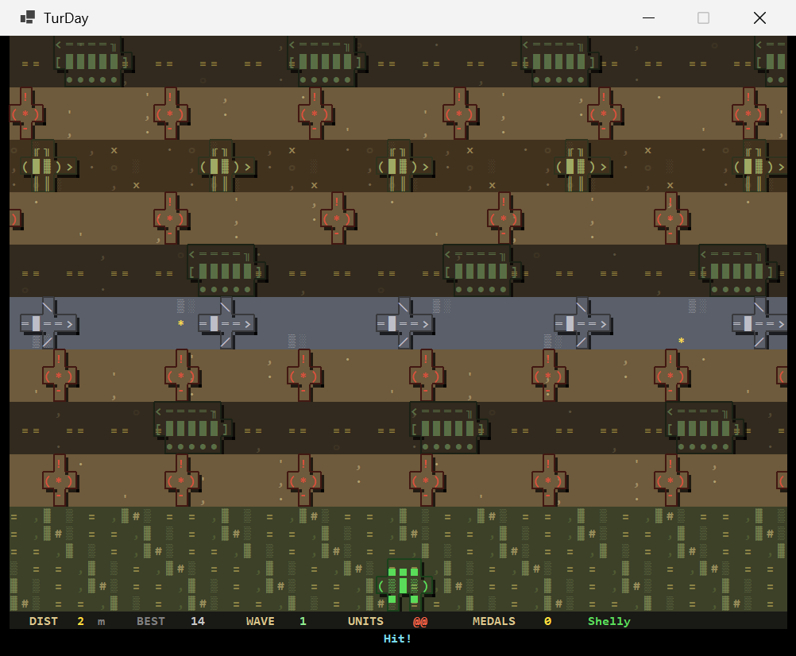

# TurDay — Operation Shellstorm

> **A turtle's trip to the beach. Against all odds.**

You're a turtle. The beach is up there. Between you and it: tank divisions, strafing dive-bombers, marching infantry, minefields, tracer fire, and barbed wire. You have three lives. *Move.*



---

## Storm the beach

The world scrolls under you forever. Every lane you cross adds to your **DIST**. Every 30 lanes you reach a **BEACHHEAD** for a fat stage bonus and a difficulty spike. Die enough times, your run ends — but coins you grabbed during it are kept and spent on **new turtles** with new perks.



There's no level select. There's no end. Just one direction: forward, until you can't.

---

## What's in your way

| Hazard | What it does |
|---|---|
| **Tanks** | Roll across roads in olive drab. Slow but lethal — and they cluster. |
| **Planes** | Strafe the sky lanes with banking wings. Faster than tanks. |
| **Soldiers** | Patrol no-man's-land in helmeted squads. |
| **Mines** | Static, dug into tan minefields. Walk on one and it's over. |
| **Tracer rounds** | Bright streaks fly across dusk lanes at high speed — bursts you have to time. |
| **Barbed wire** | Doesn't damage you. *Blocks* you. Make a hole or go around. |



---

## Score, characters, and persistence

- **Flappy-Bird-style scoring**: every new lane forward = +1. Crossing a beach milestone = +25 × wave. Beat your **HIGH SCORE** for a `★ NEW HIGH SCORE ★` banner on the run-over screen.
- **Coins (medals)**: scattered through grass strips. They bank to your save file at the end of each run.
- **Unlockable characters** with passive perks:
  - **Shelly** (free) — the standard turtle.
  - **Snapper** (50 medals) — +1 starting life.
  - **Zippy** (75 medals) — hazards move 15 % slower.
  - **Wraith** (150 medals) — one free hazard pass per stage.
- **Save file** at `%APPDATA%\TurDay\save.json` — coins, high score, best stage, unlocked characters. Reset from the title menu.



---

## Controls

| Key | Action |
|---|---|
| **Arrows / WASD** | Move (left/right hold-to-strafe; up/down deliberate per press) |
| **Enter / Space** | Confirm |
| **Esc** | Pause |
| **Q** | Quit run / app |

Lateral movement auto-repeats while held — strafing through a tracer barrage feels snappy. Forward and back **don't** auto-repeat: you choose your moments.

---

## Visuals

ASCII-grid game rendered in a real Windows window. Hybrid pixel-art style:

- **Multi-cell character sprites** built from Unicode block chars (`█▒░▓▀▄`)
- **Per-sprite silhouette outlines** in a darker shade of each unit's color
- **Drop shadows** along the bottom-right of every gameplay sprite
- **Animated lane backgrounds** — drifting clouds, scrolling tank-tread roads, lapping waves on the beach, blinking coin pickups
- **Screen shake** on hits

It's a console aesthetic, but with proper graphics underneath, so the window can be much larger than a terminal and the action stays smooth.

---

## Quick start

Grab `turday.exe` from the [latest release](https://github.com/matthewafay/Turday/releases/latest) and double-click. No installer. No runtime needed — the .NET 10 runtime is bundled. Windows x64 only.

### Build from source

Requires the [.NET 10 SDK](https://dotnet.microsoft.com/download).

```powershell
git clone https://github.com/matthewafay/Turday.git
cd Turday
dotnet run                           # debug
dotnet publish -c Release            # produces bin/Release/net10.0-windows/win-x64/publish/turday.exe
```

### Args

```
turday [--seed N]      # deterministic level generation (useful for repro / sharing seeds)
       [--start-y N]   # debug: spawn at world Y N (e.g. --start-y 30 for the first beachhead)
       [--help]
```

---

## Credits

Created by **Matthew Fay**.

Built with .NET 10 + WinForms. Renderer is a custom GDI text-grid drawing every cell with `TextRenderer.DrawText` in **Consolas 16 px**, plus per-sprite outline + drop-shadow passes for depth. Game logic, world, and renderer are decoupled — swapping the host for Avalonia / Raylib / a Win32 console would be straightforward.

License: see [LICENSE](LICENSE) if present, otherwise all rights reserved.
